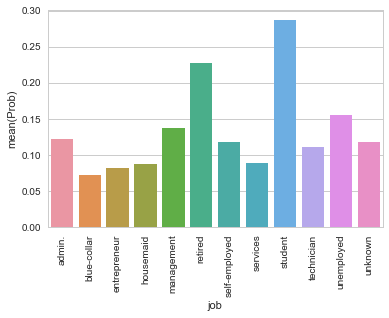
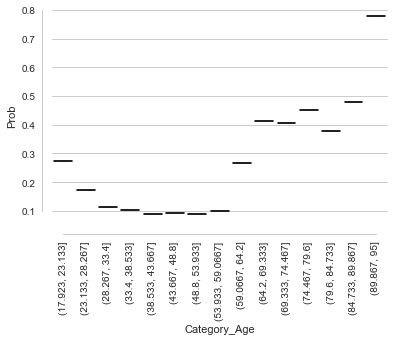

```python
import pandas as pd
import numpy as np
import matplotlib.pyplot as plt
import seaborn as sns
sns.set(style='whitegrid')
from scipy import stats, integrate
%matplotlib inline
df = pd.read_csv('D:/Daten/06 Datenanalyse/Alex/bank-full.csv',sep=';')
df.head()
```


<div>
<table border="1" class="dataframe">
  <thead>
    <tr style="text-align: right;">
      <th></th>
      <th>age</th>
      <th>job</th>
      <th>marital</th>
      <th>education</th>
      <th>default</th>
      <th>balance</th>
      <th>housing</th>
      <th>loan</th>
      <th>contact</th>
      <th>day</th>
      <th>month</th>
      <th>duration</th>
      <th>campaign</th>
      <th>pdays</th>
      <th>previous</th>
      <th>poutcome</th>
      <th>y</th>
    </tr>
  </thead>
  <tbody>
    <tr>
      <th>0</th>
      <td>58</td>
      <td>management</td>
      <td>married</td>
      <td>tertiary</td>
      <td>no</td>
      <td>2143</td>
      <td>yes</td>
      <td>no</td>
      <td>unknown</td>
      <td>5</td>
      <td>may</td>
      <td>261</td>
      <td>1</td>
      <td>-1</td>
      <td>0</td>
      <td>unknown</td>
      <td>no</td>
    </tr>
    <tr>
      <th>1</th>
      <td>44</td>
      <td>technician</td>
      <td>single</td>
      <td>secondary</td>
      <td>no</td>
      <td>29</td>
      <td>yes</td>
      <td>no</td>
      <td>unknown</td>
      <td>5</td>
      <td>may</td>
      <td>151</td>
      <td>1</td>
      <td>-1</td>
      <td>0</td>
      <td>unknown</td>
      <td>no</td>
    </tr>
    <tr>
      <th>2</th>
      <td>33</td>
      <td>entrepreneur</td>
      <td>married</td>
      <td>secondary</td>
      <td>no</td>
      <td>2</td>
      <td>yes</td>
      <td>yes</td>
      <td>unknown</td>
      <td>5</td>
      <td>may</td>
      <td>76</td>
      <td>1</td>
      <td>-1</td>
      <td>0</td>
      <td>unknown</td>
      <td>no</td>
    </tr>
    <tr>
      <th>3</th>
      <td>47</td>
      <td>blue-collar</td>
      <td>married</td>
      <td>unknown</td>
      <td>no</td>
      <td>1506</td>
      <td>yes</td>
      <td>no</td>
      <td>unknown</td>
      <td>5</td>
      <td>may</td>
      <td>92</td>
      <td>1</td>
      <td>-1</td>
      <td>0</td>
      <td>unknown</td>
      <td>no</td>
    </tr>
    <tr>
      <th>4</th>
      <td>33</td>
      <td>unknown</td>
      <td>single</td>
      <td>unknown</td>
      <td>no</td>
      <td>1</td>
      <td>no</td>
      <td>no</td>
      <td>unknown</td>
      <td>5</td>
      <td>may</td>
      <td>198</td>
      <td>1</td>
      <td>-1</td>
      <td>0</td>
      <td>unknown</td>
      <td>no</td>
    </tr>
  </tbody>
</table>
</div>


```python
#----------------------------------------------------------------------------------------------------------------------------
#Wahrscheinlichkeit von y=1:
#----------------------------------------------------------------------------------------------------------------------------

probability_y=df.y[df.y=='yes'].count()/df['y'].shape[0]
print(probability_y)
print('Die Wahrscheinlichkeit von y = 1 beträgt' , probability_y*100, '%')
```

    0.116984804583
    Die Wahrscheinlichkeit von y = 1 beträgt 11.6984804583 %
    


```python
#----------------------------------------------------------------------------------------------------------------------------
#Konditionale Wahrscheinlichkeiten für y=1 nach Job Kategorie:
#----------------------------------------------------------------------------------------------------------------------------

prob_job_y1=pd.DataFrame(df[df.y=='yes'].groupby('job').size()/df.groupby('job').size(),columns=['Prob'])
print('Konditionale Wahrscheinlichkeiten für y=1 nach Job Kategorie in %\n', prob_job_y1*100)
sns.barplot(x=prob_job_y1.index, y=prob_job_y1.Prob)
plt.xticks(rotation=90)
```

    Konditionale Wahrscheinlichkeiten für y=1 nach Job Kategorie in %
                         Prob
    job                     
    admin.         12.202669
    blue-collar     7.274969
    entrepreneur    8.271688
    housemaid       8.790323
    management     13.755551
    retired        22.791519
    self-employed  11.842939
    services        8.883004
    student        28.678038
    technician     11.056996
    unemployed     15.502686
    unknown        11.805556
    


    (array([ 0,  1,  2,  3,  4,  5,  6,  7,  8,  9, 10, 11]),
     <a list of 12 Text xticklabel objects>)





```python
#----------------------------------------------------------------------------------------------------------------------------
#Profile Chart von y über Alter
#----------------------------------------------------------------------------------------------------------------------------

a=df.assign(Category_Age=pd.DataFrame.from_records(pd.cut(df.age,15,retbins=True)).T[0])
print(a.head())
prob_age_y1=pd.DataFrame(a[a.y=='yes'].groupby('Category_Age').size()/a.groupby('Category_Age').size(),columns=['Prob'])
print(prob_age_y1.head())
sns.boxplot(x=prob_age_y1.index, y="Prob", data=prob_age_y1, palette="PRGn")
sns.despine(offset=10, trim=True)
plt.xticks(rotation=90)
```

       age           job  marital  education default  balance housing loan  \
    0   58    management  married   tertiary      no     2143     yes   no   
    1   44    technician   single  secondary      no       29     yes   no   
    2   33  entrepreneur  married  secondary      no        2     yes  yes   
    3   47   blue-collar  married    unknown      no     1506     yes   no   
    4   33       unknown   single    unknown      no        1      no   no   
    
       contact  day month  duration  campaign  pdays  previous poutcome   y  \
    0  unknown    5   may       261         1     -1         0  unknown  no   
    1  unknown    5   may       151         1     -1         0  unknown  no   
    2  unknown    5   may        76         1     -1         0  unknown  no   
    3  unknown    5   may        92         1     -1         0  unknown  no   
    4  unknown    5   may       198         1     -1         0  unknown  no   
    
            Category_Age  
    0  (53.933, 59.0667]  
    1     (43.667, 48.8]  
    2     (28.267, 33.4]  
    3     (43.667, 48.8]  
    4     (28.267, 33.4]  
                          Prob
    Category_Age              
    (17.923, 23.133]  0.274162
    (23.133, 28.267]  0.172577
    (28.267, 33.4]    0.113952
    (33.4, 38.533]    0.104186
    (38.533, 43.667]  0.090728
    


    (array([ 0,  1,  2,  3,  4,  5,  6,  7,  8,  9, 10, 11, 12, 13, 14]),
     <a list of 15 Text xticklabel objects>)





```python

```
